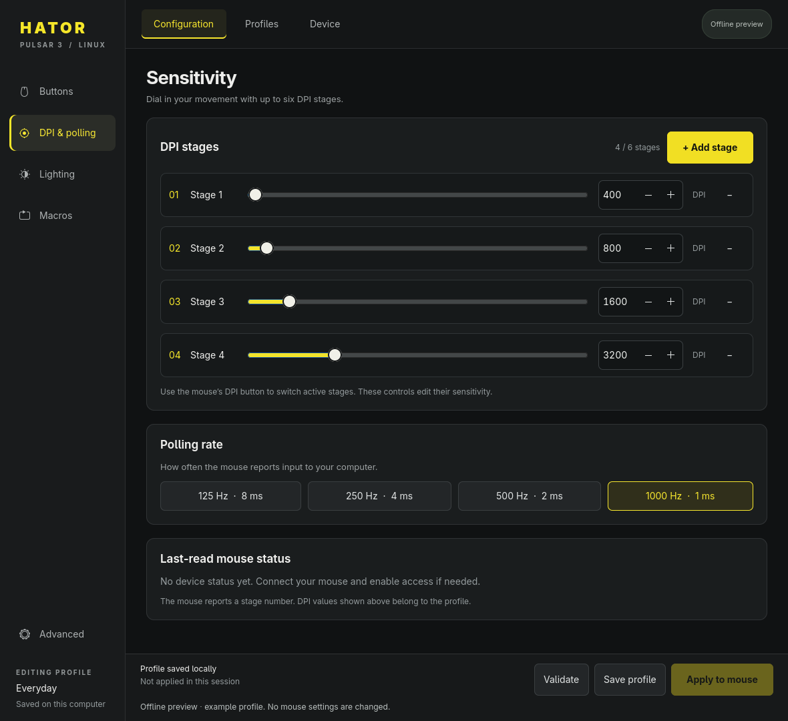
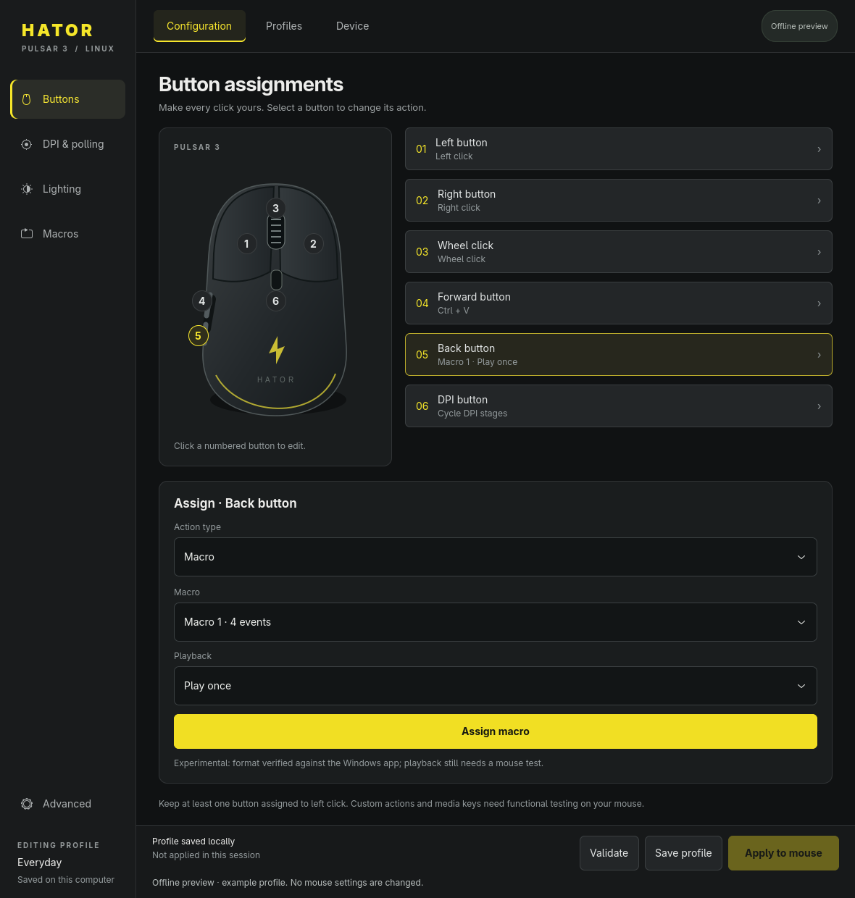
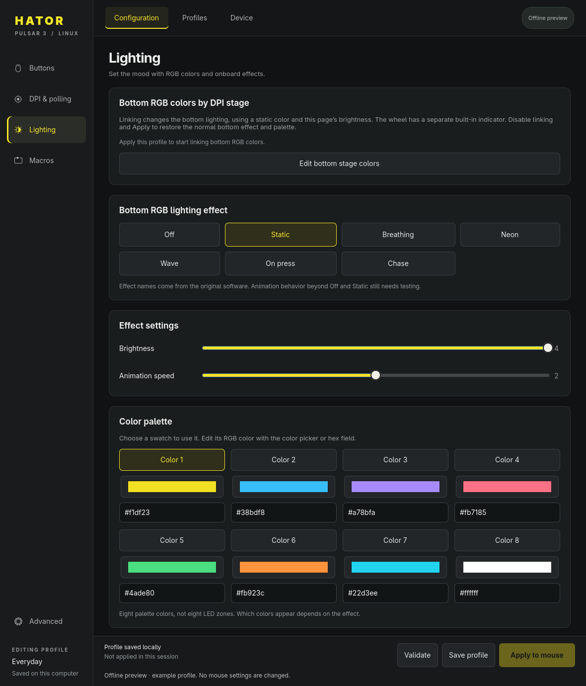
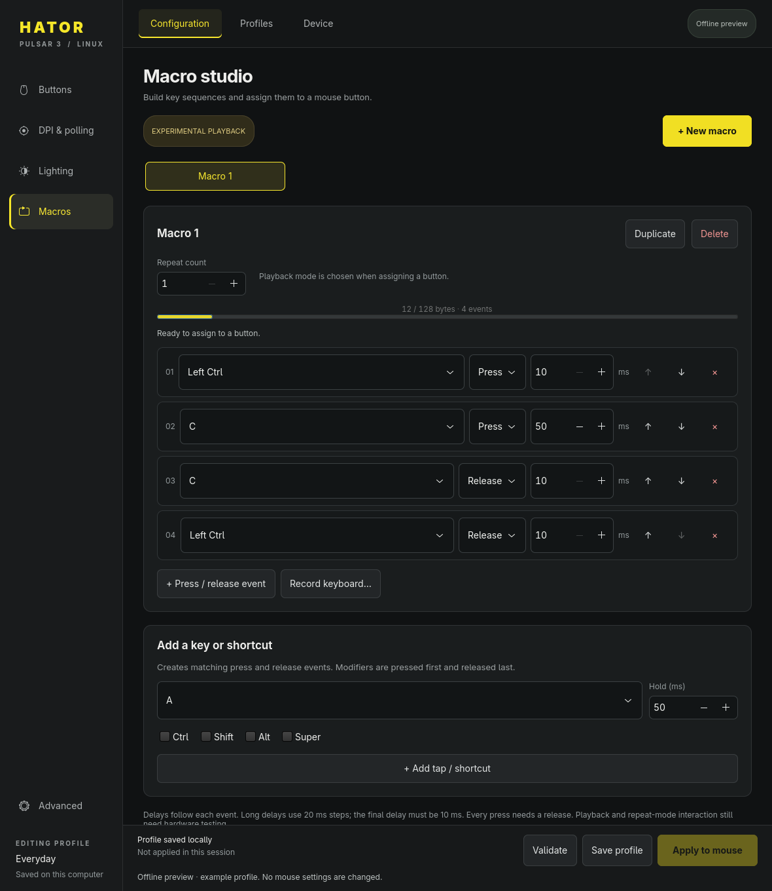

# Pulsar 3 Studio for Linux

[](https://github.com/cjvnjde/pulsar-linux/actions/workflows/build.yml)
[](LICENSE)

A native Linux configurator for the **HATOR Pulsar 3 wired mouse, USB `379a:3910`**.
Change DPI, polling rate, RGB lighting, button assignments, shortcuts, and macros
through a GTK4 interface or command-line tool. No Windows, Wine, VM, or firmware
replacement is needed.

This is an independent community project, not official HATOR software. Support for
other HATOR models, wireless receivers, and Pulsar Gaming Gears mice is not established.

[Download releases](https://github.com/cjvnjde/pulsar-linux/releases) ·
[Latest build artifacts](https://github.com/cjvnjde/pulsar-linux/actions/workflows/build.yml) ·
[User guide](USER_GUIDE.md) · [Capabilities](UI_CAPABILITIES.md) · [Protocol](PROTOCOL.md)

## Features

| Area | Controls |
|---|---|
| Buttons | Six-button mouse diagram, standard mouse/DPI/media actions, keyboard shortcuts, macro bindings, advanced action bytes |
| Sensitivity | 1–6 reorderable stages, 200–12000 DPI in steps of 100, 125/250/500/1000 Hz polling; separate built-in wheel-color reference |
| Lighting | Bottom RGB effects, brightness/speed, eight palette entries; optional bottom color per DPI stage while the app runs |
| Macros | Twelve slots, event editor, focused keyboard recording, delays, repeat count, three playback modes, capacity validation |
| Profiles | Named local files, open/save/save as, revert edits, Advanced JSON |
| Linux access | Graphical password dialog for temporary device permissions; live status and connection errors |

Editing and saving are separate from **Apply to mouse**. The app validates a complete
profile before sending it and keeps at least one button assigned to left-click.

## Screenshots

Actual GTK4 interface, shown in offline mode with an example profile.



<details>
<summary>Buttons, lighting, and macro editor</summary>

### Button assignments



### RGB lighting



### Custom macros



</details>

## Download and run

GitHub Actions builds two downloads and `SHA256SUMS` on pushes, pull requests, and
manual runs. Open a successful run and download **pulsar3-studio-linux** from its
Artifacts section. GitHub requires sign-in to download workflow artifacts; tagged
builds are also published under Releases for easier public downloads.

### Ubuntu 22.04 or newer / Debian 12 or newer

Download the `.deb` file, then install it with dependency resolution:

```sh
sudo apt install ./pulsar3-studio_*_all.deb
pulsar3-gui
```

The package installs a **Pulsar 3 Studio** entry in the application menu and a
`pulsar3` CLI. GTK 4.6 or newer is required; older distribution releases may not
meet this requirement.

### Arch Linux

Install the build tools, then build and install the package as your normal user:

```sh
sudo pacman -S --needed base-devel git
```

```sh
git clone https://github.com/cjvnjde/pulsar-linux.git
cd pulsar-linux/packaging/arch
makepkg -si
```

Review `PKGBUILD` before running it. It downloads the versioned Linux release and
desktop assets pinned to the matching release commit, verifies SHA-256 checksums,
and installs runtime dependencies through pacman. Do not run `makepkg` as root.
The package installs the **Pulsar 3 Studio** application-menu entry, `pulsar3-gui`,
and the `pulsar3` CLI. A graphical Polkit authentication agent must be running for
**Enable device access**; use your desktop's agent or install one for your session.

For updates before an AUR publication, pull the repository and rebuild when its
PKGBUILD version changes:

```sh
git pull --ff-only
makepkg -si
```

This repository provides the recipe; it does not publish the package to AUR.
If `pulsar3-studio` is published there in the future, install it with
`paru -S pulsar3-studio` (or `yay -S pulsar3-studio`) and update with `paru -Syu`
(or `yay -Syu`). AUR updates require its maintainer to update the recipe for each
release; the helper does not track GitHub releases automatically.

### Fedora and other Linux distributions (portable archive)

Download and extract the `*-linux.tar.gz` archive. It contains the application,
assets, defaults, and documentation. **Python and GTK are system dependencies;
this archive is not a self-contained AppImage.**

Arch users who prefer the portable archive can install its dependencies with:

```sh
sudo pacman -S --needed python python-gobject gtk4 libadwaita polkit acl
```

On Fedora:

```sh
sudo dnf install python3 python3-gobject gobject-introspection gtk4 libadwaita polkit acl
```

Then run the launcher from the extracted directory:

```sh
./pulsar3-gui
```

A graphical Polkit authentication agent must be running for the password dialog.
Most desktop environments provide one. The application itself runs as your normal
user; do not run the whole GUI with `sudo`.

The app uses standard GTK, XDG paths, and Linux USB interfaces. It works with X11
and Wayland and has no dependency on Omarchy or Hyprland. Other distributions can
use the same archive with the runtime dependencies below. GTK 4.6–4.8 uses the
older GTK color and confirmation dialogs; newer GTK uses the current dialogs.
CI exercises Ubuntu 22.04, Debian 12, Fedora 44, and the Ubuntu 24.04 packages.

To check downloaded files before extracting/installing:

```sh
sha256sum -c SHA256SUMS
```

### Run from source

```sh
git clone https://github.com/cjvnjde/pulsar-linux.git
cd pulsar-linux
./pulsar3-gui
```

Dependencies: Python 3.10+, PyGObject, GTK 4.6+, libadwaita, `pkexec`, `setfacl`, and
a graphical authentication agent. On Ubuntu or Debian:

```sh
sudo apt install python3 python3-gi gir1.2-gtk-4.0 gir1.2-adw-1 pkexec acl
```

For an offline editor, with all device operations disabled:

```sh
./pulsar3-gui --offline
```

## First configuration

1. Connect one supported mouse.
2. Open **Device → Enable device access** and authenticate in the system dialog.
3. Edit the profile. For a macro, create it on **Macros**, then assign it on **Buttons**.
4. Click **Validate**, then **Apply to mouse**.

Device access is temporary. Repeat after reconnecting or rebooting if needed. The
app discovers USB paths automatically, claims only the configuration interface,
and does not detach normal mouse/keyboard drivers.

The physical DPI button switches stages. The old software-stage-selection command
was ignored by the tested mouse and is not exposed as a working control.

### Wheel indicator and bottom RGB colors

The scroll wheel has a separate, built-in DPI indicator. Its stage colors follow
the [wired Pulsar 3 manual](https://downloads.hator.com/wp-content/uploads/instructions/hator-mice-manual/HATOR_Pulsar%203_HTM610_HTM611_manual.pdf):
red, green, blue, cyan, yellow, purple. The DPI page shows these as a reference
beside the numbered slots. A supported command for customizing the wheel's
palette has not been established; the bottom RGB palette does not control it.

For the bottom lighting, enable **Link bottom RGB lighting to DPI stage**, choose
the custom color swatches, then **Apply to mouse**. The app follows the active
stage about twice per second and changes the bottom RGB to that static color at
the profile's brightness. Saved custom bottom colors remain visible while linking
is off, with editing disabled. The wheel can still show blue even when none of
your custom bottom colors are blue.

Use the **↑ / ↓** buttons to reorder stages. DPI values and custom bottom colors
move together; wheel colors remain attached to the numbered slots. Profiles can
contain just one, two, or three stages. If the mouse temporarily reports a removed
stage, bottom linking waits for a configured stage and resumes automatically
instead of rejecting the profile or repeatedly resetting lighting. The DPI page
also shows the DPI button's assignment; use **Cycle DPI stages** for stage cycling.

Keep the app open or minimized. Closing it stops automatic changes and leaves the
last color set; after restarting, Apply again to resume. To restore your normal
effect and palette, disable linking and Apply. Profile edits and Save alone do
not change the active mapping. After a device error or reconnect, restore access
if needed and Apply again. This is a Linux app feature, not a verified onboard
DPI-to-color setting. The one-shot CLI Apply command does not start the follower.

## Profiles and history

The application follows XDG directory settings:

| Data | Default location |
|---|---|
| Saved profiles | `~/.local/share/pulsar3/profiles/` |
| Last successfully submitted working profile | `~/.local/share/pulsar3/profiles/linux.json` |
| Write journals | `~/.local/state/pulsar3/history/` |
| Bundled defaults | `pulsar3/data/default.json` in the application |

`XDG_DATA_HOME` and `XDG_STATE_HOME` override the first two base directories.
Profiles can also be opened or saved at a location of your choice.

Older checkouts with `profiles/linux.json` are read if no user-data working profile
exists; subsequent saves go to user data. The legacy file is preserved. Personal
profiles, write journals, and extracted vendor software are excluded from builds.

**Save profile** changes a local file only. After successful Apply, the app saves
the submitted working profile. Failed transfers keep the previous working file but
can leave some hardware settings changed. Journals are diagnostic records, not full
hardware backups.

## What is verified?

- Native status and configuration communication work on a connected `379a:3910` mouse.
- Polling/lighting changes were checked through a device-status round trip.
- Bottom DPI-linked colors were checked with the physical DPI button through all
  six stages. The user clarified that these affect the bottom lighting, while the
  wheel retains its separate built-in indicator colors.
- DPI and standard button settings were transmitted successfully.
- The user tested Sniper action: holding the assigned button lowers sensitivity
  for slow, precise movement; the exact target DPI remains unmeasured.
- Packet construction matches original executable fixtures, including 288 button
  conversions, 21 macro vectors, and 18 complete DPI packets generated by the
  original embedded QML and machine code. DPI values are absolute. Live raw-motion
  measurements confirmed substantial sensitivity changes, but the 12000-DPI
  estimate fell below its target; exact high-DPI accuracy remains unresolved.
- **Macro playback, alternative button actions, and every lighting animation still
  need functional testing.** Their editors and encoders being implemented does not
  prove all hardware behavior.

Live readback includes polling rate, active DPI stage, lighting mode, and speed.
It does not include DPI values, brightness, RGB values, assignments, or macros.
Onboard profile banks and persistence of every setting after power loss are not
verified. There is no firmware updater or complete device-backup reader.

### Sniper action and DPI colors

The original software calls one action **Sniper Key** (`dpi-lock` internally).
The user confirmed that it lowers sensitivity while pressed. Its target DPI has
not been measured, and there is no verified separate sniper-DPI field. Assigning
this action to the DPI button replaces that button's normal stage cycling.

HATOR documents a scroll-wheel DPI indicator on the Pulsar 3. Custom bottom colors
use the app's follower, which fills the bottom effect palette with the active
stage's color. Custom wheel colors and per-LED addressing remain unsupported.

## CLI

From a checkout or extracted archive:

```sh
python3 -m pulsar3 detect
python3 -m pulsar3 status
python3 -m pulsar3 plan pulsar3/data/default.json
python3 -m pulsar3 apply /path/to/profile.json --commit
```

With the Debian or Arch package, use `pulsar3` instead of `python3 -m pulsar3`.
`apply` without `--commit` previews packets without writing configuration.
See the [user guide](USER_GUIDE.md) for selective writes and profile examples.

## Development and releases

```sh
python3 -m unittest discover -s tests -v
python3 tools/gui_smoke.py                 # requires a graphical session
python3 tools/build_release.py            # writes dist/; standard library only
python3 tools/capture_screenshots.py      # refresh README images using example data
```

The GUI smoke test uses temporary user-data directories and simulated device results;
it does not configure a connected mouse. CI installs the generated Debian package
and runs this test under Xvfb against the installed code.

The build script creates a Linux archive, architecture-independent Debian package,
and SHA256 checksums from an explicit file list. No secrets or publishing credentials
are required to run tests or produce artifacts.

The Arch recipe lives in `packaging/arch/PKGBUILD`. Its CI job builds the pinned
release with `makepkg`, inspects it with `namcap`, installs it, validates the desktop
entry, and exercises the installed CLI and offline GUI. It tests the recipe's
release version, while the other jobs test the current checkout.

After publishing a new GitHub release, update the recipe's `pkgver`, reset `pkgrel`
to `1`, and set `_commit` to that release's full commit SHA. Download and inspect
the new sources, then regenerate their checksums with `updpkgsums` (`pacman-contrib`)
and validate with `makepkg --verifysource` and `makepkg --cleanbuild -si`.
For packaging-only changes to the same version, increment `pkgrel`. If publishing
to AUR, copy the recipe into its separate AUR repository, generate `.SRCINFO` with
`makepkg --printsrcinfo > .SRCINFO`, and commit both files for every update.

To publish a release, update `pulsar3.__version__`, commit it, and push a matching
`vMAJOR.MINOR.PATCH` tag. The workflow tests/builds it and attaches downloads to a
GitHub Release. Ordinary branch builds remain Actions artifacts for 30 days.

## License and credits

[MIT](LICENSE), copyright cjvnjde and contributors. This license covers this
project's code and documentation, not HATOR's proprietary software or trademarks.
The original Windows installer is preserved as research reference material in
[sources/windows](https://github.com/cjvnjde/pulsar-linux/tree/main/sources/windows),
with its SHA-256 checksum and third-party licensing notice. It is a compiled
installer, not vendor source code, and is excluded from the Linux application
packages. GitHub's repository source archives include it. Extracted QML and
decompiled vendor code are not distributed. See [PROTOCOL.md](PROTOCOL.md) for
reverse-engineering evidence.

<sub>This project contains AI-generated code created with OpenAI Codex.</sub>
